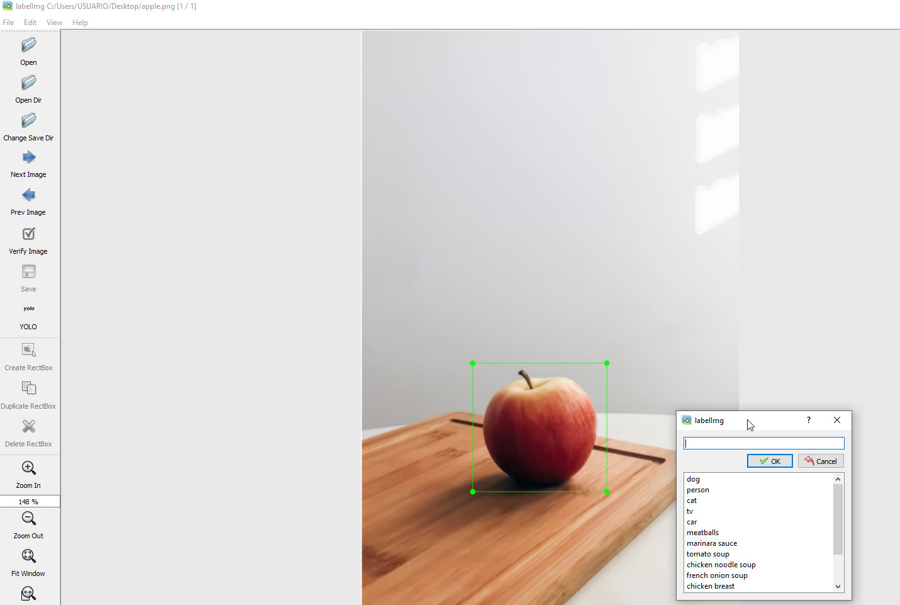

# **YOLO con modulos de atención SE - CBAM** #
## **Diseñado por:**
* *Alba Maria Ramirez Marquinez*
    * **Código:** 2216260
* *Milton Guarin Arias* 
    * **Código:** 2210702
* *Carlos Arbey Mejia Martinez*
    * **Código:** 2210549
* *Andres Felipe Guerra Vargas* 
    * **Código:** 2211058

## **Contenido** ##

En este repositorio encontrará la documentación, fuentes y resultados obtenidos con la comparación de los modelos de la arquitectura YOLO v3 utilizando mecánismos de atención SE (Squeeze-and-Excitation) y CBAM (Convolutional Block Attention Module).

Los modelos se entrenarán para detectar cascos de motocicleta/bicicleta en diferentes imágenes obtenidas de internet, asi mismo, se realizará la prueba de detección del objeto también en un video.

## **Resumen** ##

La detección de objetos en imágenes implica no solo identificar qué tipo de objeto es, también ubicarlo dentro de la imagen (obtener las coordenadas de la "caja" que lo contiene). En otras palabras, detección = clasificación + ubicación.

YOLO (You Only Look Once) es el algoritmo de detección de objetos más popular actualmente, utiliza deep learning y CNN para detectar objetos, y se distingue de sus competidores (RCNN, Faster-RCNN) porque, como su nombre indica, requiere “ver ”La imagen solo una vez, lo que le permite ser la más rápida de todas (aunque sacrifica un poco la precisión). Esta velocidad le permite detectar fácilmente objetos en tiempo real en video (hasta 30 FPS).

En el presente trabajo se utilizará el algoritmo YOLO v3 con dos mecanismos de atención, SE (Squeeze-and-Excitation) y CBAM (Convolutional Block Attention Module), validando el desempeño en un dataset de imagen personalizado con una sola clase. Los resultados serán presentados y evaluados para realizar una comparación del modelo con el mejor desempeño en la tarea de detección de objetos.

## **Implementación** ##

**1. Generación DataSet:**  Para la generación del dataset de imágenes personalizado se definió la clase “helmet” correspondiente imagenes de personas usando cascos de motocicleta/bicicleta.  Se descargaron 250 imágenes de internet en diferentes escenarios.

Luego de descargar las imagenes, se realiza el etiquetado de los objetos en cada imagen.  El etiquetado consiste en dibujar cuadros delimitadores alrededor de los objetos que queremos detectar, para lo cual utilizamos la herramienta **LabelImg** tomada del repositorio Git [LabelImg](https://github.com/tzutalin/labelImg). 

Para la instalación, se utilizó la aplicación Anaconda para implementar un entorno python, a este entorno se le instalo lo siguiente para la correcta utilización del programa LabelImg:

```bash
conda install pyqt=5
conda install -c anaconda lxml
pyrcc5 -o libs/resources.py resources.qrc
```
Para iniciar el programa LabelImg:
    
```bash
python labelImg.py
```

<p align="center">

</P>

En la toma de las imagenes se crearon dos archivos bash Windows de apoyo para la transformación de los nombres de las imagenes **Change_name.ps1** y **Change_name_replace.ps1**, el proposito de estos script es el siguiente:

*   **Change_name.ps1:** Cambiar el nombre de las imagenes descargas a las nomenclaturas definidas por el equipo. La estructura de los nombres de la imagenes será, **[Inicial_Ingeniero]\_img\_[id].[extension_imagen]**
    
*   **Change_name_replace.ps1:** Ajustar los nombres de los archivos .txt con la información de los bounding boxes de las imagenes a que correspondan al mismo nombre de la imagen generando así su emparejamiento.

*   **Redimensionamiento:** Dado que las imagenes que se buscaron en internet presentan diferentes dimensiones, se creo el colab **Utilidades/Images_transform.ipynb** para redimensionarlas todas a un tamaño predefinido de 416x416, a continuación se puede visualizar un ejemplo del redimensionado que se genero sobre las imagenes.

<p align="center">

</P>

Las imagenes originales se podrán en contrar en el repositorio [Repositorio Google Drive](https://drive.google.com/drive/folders/1XLkhu0QKoeiVU00qahQfJsPmESpb9Y3l?usp=sharing) en la carpeta **images_ori** y las imagenes redimensionadas se podrán encontrar en la carpeta **images**.


**2. Implementación y entrenamiento de los modelos:** Para llevar la implementacion y el entrenamiento de YOLOv3 con nuestra clase **helmet** se creó un cuaderno en Google Colab **YOLO_tiny_se.ipynb**, el cual presenta los llamados necesarios a la librería de YOLOv3 tomado del repositorio GitHub [PyTorch-YOLOv3](https://github.com/promach/PyTorch-YOLOv3)


## **Resultados** ##


## **Links alternos al repositorio:** ##
* [Repositorio Google Drive](https://drive.google.com/drive/folders/1XLkhu0QKoeiVU00qahQfJsPmESpb9Y3l?usp=sharing)

## **Referencias:** ##
* [LabelImg](https://github.com/tzutalin/labelImg)
* [PyTorch-YOLOv3](https://github.com/promach/PyTorch-YOLOv3)
