# **YOLO con módulos de atención SE - CBAM** #
## **Diseñado por:**
* *Alba Maria Ramirez Marquinez*
    * **Código:** 2216260
* *Milton Guarin Arias* 
    * **Código:** 2210702
* *Carlos Arbey Mejia Martinez*
    * **Código:** 2210549
* *Andres Felipe Guerra Vargas* 
    * **Código:** 2211058

## **Contenido** ##

En este repositorio encontrará la documentación, fuentes y resultados obtenidos con la comparación de los modelos de la arquitectura YOLO v3 utilizando mecánismos de atención SE (Squeeze-and-Excitation) y CBAM (Convolutional Block Attention Module).

Los modelos se entrenarán para detectar cascos de motocicleta/bicicleta en diferentes imágenes obtenidas de internet, asi mismo, se realizará la prueba de detección del objeto también en un video.

## **Resumen** ##

La detección de objetos en imágenes implica no solo identificar qué tipo de objeto es, también ubicarlo dentro de la imagen (obtener las coordenadas de la "caja" que lo contiene). En otras palabras, detección = clasificación + ubicación.

YOLO (You Only Look Once) es el algoritmo de detección de objetos más popular actualmente, utiliza deep learning y CNN para detectar objetos, y se distingue de sus competidores (RCNN, Faster-RCNN) porque, como su nombre indica, requiere “ver ”La imagen solo una vez, lo que le permite ser la más rápida de todas (aunque sacrifica un poco la precisión). Esta velocidad le permite detectar fácilmente objetos en tiempo real en video (hasta 30 FPS).

<p align="center">

<p align="center">Fig 1. El modelo de YOLO</P>
</P>

Este algoritmo trata la detección de objetos como un problema de regresión, tomando una imagen de entrada dada y aprendiendo simultáneamente las coordenadas del cuadro delimitador y las probabilidades de etiqueta de clase correspondientes, como se observa en la imagen anterior.

En el presente trabajo se utilizará el algoritmo YOLO v3 con dos mecanismos de atención, SE (Squeeze-and-Excitation) y CBAM (Convolutional Block Attention Module), validando el desempeño en un dataset de imagen personalizado con una sola clase. Los resultados serán presentados y evaluados para realizar una comparación del modelo con el mejor desempeño en la tarea de detección de objetos.

## **Generación Dataset** ##

Para la generación del dataset de imágenes personalizado se definió la clase “helmet” correspondiente imagenes de personas usando cascos de motocicleta/bicicleta.  Se descargaron 250 imágenes de internet en diferentes escenarios.

<p align="center">

<p align="center">Fig 2. Dataset de cascos (Clase: helmet) </P>
</P>

Luego de descargar las imagenes, se realiza el etiquetado de los objetos en cada imagen, para lo cual utilizamos la herramienta **LabelImg** tomada del repositorio Git [LabelImg](https://github.com/tzutalin/labelImg). 

Para la instalación, se utilizó la aplicación Anaconda para implementar un entorno python, a este entorno se le instalo lo siguiente para la correcta utilización del programa LabelImg:

```bash
conda install pyqt=5
conda install -c anaconda lxml
pyrcc5 -o libs/resources.py resources.qrc
```
Para iniciar el programa LabelImg:
    
```bash
python labelImg.py
```

<p align="center">

<p align="center">Fig 3. Interfaz gráfica LabelImg</P>
</P>

El etiquetado consiste en dibujar cuadros delimitadores alrededor de los objetos que queremos detectar.  Para etiquetar los objetos en cada imagen, simplemente cargas todas las imágenes, dibujas el recuadro sobre el objeto de clase que quieres detectar, seleccionas la clase y se guarda la imagen cuando termines todos los recuadros de los objetos.  Cuando guarda las etiquetas después de cada imagen, labelImg crea un archivo de texto para cada imagen con el mismo nombre que la imagen.   Lo bueno de LabelImg es que nos permite guardar las anotaciones directamente en formato YOLO.  Cada archivo txt, tendrá los siguientes datos:

**object-id center_x center_y width height**

Donde: object-id representa el identificador de la clase, center_x y center_y el punto central del cuadro delimitador y width height el ancho y alto del cuadro delimitador.

El archivo de texto de anotación generado contendrá cada línea como la anterior para cada límite en la imagen y un archivo de texto para cada imagen.

<p align="center">

<p align="center">Fig 4. Archivo txt formato YOLO </P>
</P>

En la toma de las imagenes se crearon dos archivos bash Windows de apoyo para la transformación de los nombres de las imagenes **Change_name.ps1** y **Change_name_replace.ps1**, el proposito de estos script es el siguiente:

*   **Change_name.ps1:** Cambiar el nombre de las imagenes descargas a las nomenclaturas definidas por el equipo. La estructura de los nombres de la imagenes será, **[Inicial_Ingeniero]\_img\_[id].[extension_imagen]**
    
*   **Change_name_replace.ps1:** Ajustar los nombres de los archivos .txt con la información de los bounding boxes de las imagenes a que correspondan al mismo nombre de la imagen generando así su emparejamiento.

*   **Redimensionamiento:** Dado que las imagenes que se buscaron en internet presentan diferentes dimensiones, se creo el colab **Utilidades/Images_transform.ipynb** para redimensionarlas todas a un tamaño predefinido de 416x416, a continuación se puede visualizar un ejemplo del redimensionado que se genero sobre las imagenes.

<p align="center">

<p align="center">Fig 5. Imagen original e imagen redimensionada</P>
</P>

Las imagenes originales se podrán en contrar en el repositorio [Repositorio Google Drive](https://drive.google.com/drive/folders/1XLkhu0QKoeiVU00qahQfJsPmESpb9Y3l?usp=sharing) en la carpeta **images_ori** y las imagenes redimensionadas se podrán encontrar en la carpeta **images**.

## **Implementación y entrenamiento de los modelos:** ## 

Para la implementacion y el entrenamiento de YOLOv3 con nuestra clase **helmet** se creó un cuaderno en Google Colab **YOLO_tiny_se.ipynb**, el cual presenta los llamados necesarios a la librería de YOLOv3 tomado del repositorio GitHub [PyTorch-YOLOv3](https://github.com/promach/PyTorch-YOLOv3)

Una vez creado el dataset, procedemos con la implementación de YOLO V3 y sus respectivas variantes con los módulos de atención SE y CBAM.

Nos basaremos en la arquitectura Tiny YOLOV3, que es una versión simplificada de YOLOV3. Es un algoritmo de detección en tiempo real desarrollado para dispositivos integrados con capacidades de procesamiento de datos deficientes. La estructura del modelo es simple y es actualmente es el algoritmo de detección de objetos más rápido, pero la precisión de detección es baja, especialmente en detección de objetos pequeños. 

Tiny YOLOV3 redujo la red de detección de funciones YOLOv3 darknet-53 a 7 capas de convolución tradicional y una capa de agrupación máxima de 6 capas, utilizando una predicción de dos escalas 13 * 13, 26 * 26 red para predecir el objetivo. La estructura de la red se muestra en la Figura 5.

<p align="center">

<p align="center">Fig 6. Arquitectura Tiny YOLOV3</P>
</P>

**1.  Preparamos el dataset.**  El dataset contiene 245 imágenes,  se dividió 80% para entrenamiento (196 imágenes) y 20% para pruebas (49 imágenes). 

**2. Clonamos el repositorio:**  

```bash
https://github.com/promach/PyTorch-YOLOv3.git
```

**3. Instalamos los requerimientos necesarios en Google Colab:**

```bash
!pip3 install -r requirements.txt
```
Para realizar el entrenamiento se ejecuta el script **train.py**, con los siguientes parámetros:

```bash
--model_def: yolov3-tiny_custom.cfg 
--data: custom.data 
--pretrained_weights: yolov3-tiny.weights
--epochs: 100
```

En el archivo **yolov3-tiny_custom.cfg** se deben configurar los siguiente parámetros:

```bash
--Capa #15 [convolutional] se cambia filters=18
--Capa #16 [yolo] se cambia classes=1
--Capa #22 [convolutional] se cambia filters=18
--Capa #23 [yolo] se cambia classes=1
```

Para implementar el **modulo de atención SE (Squeeze-and-Excitation)**, creamos un nuevo archivo de configuración de YOLOV3, insertando el mecanismo.

El entrenamiento se ejecuta igualmente con el script **train.py**, con los siguientes parámetros:

```bash
--model_def: yolov3-tiny_custom_se.cfg 
--data: custom.data 
--pretrained_weights: yolov3-tiny.weights
--epochs: 100
```

En el archivo **yolov3-tiny_custom_se.cfg** entre la capa convolucional #12 y #13 se inserta el modulo SE (Squeeze-and-Excitation):

```bash
--[se]
--reduction=16
```

Para implementar el **módulo de atención CBAM (Convolutional Block Attention Module)**, creamos un nuevo archivo de configuración de YOLOV3 insertando el mecanismo.

El entrenamiento se ejecuta igualmente con el script **train.py**, con los siguientes parámetros:

```bash
--model_def: yolov3-tiny_custom_cbam.cfg 
--data: custom.data 
--pretrained_weights: yolov3-tiny.weights
--epochs: 100
```

En el archivo **yolov3-tiny_custom_cbam.cfg** se deben configurar los siguiente parámetros:

```bash
--[cbam]
--kernelsize=7
```

## **Resultados** ##

Implementamos YOLOv3 Tiny con dos mecanismos de atención, Squeeze-Excitation (SE) y Módulo de Atención de Bloques Convolucionales (CBAM). Para el análisis presentamos los resultados de desempeño de los modelos propuestos  aplicados a la base de datos customizada:

Modelo  | Epoca | mAP
------------- | ------------- | ------------- 
YOLOV3 Tiny| 100 | 0.62992 
YOLOV3 Tiny+ SE|100   | 0.68058
YOLOV3 Tiny+ CBAM| 100  | 0.72
------------- | ------------- | -------------


**Detector de objetos en imagenes - clase "helmet"**
   
<table>
<tr>
<td>Resultados YOLOV3</td>
<td>Resultados YOLOV3 + SE</td>
<td>Resultados YOLOV3 + CBAM</td>
</tr>
<tr>
<td></td>
<td></td>
<td></td>
</tr>
<tr>
<td></td>
<td>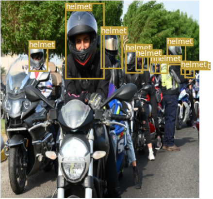</td>
<td></td>
</tr>
<tr>
<td></td>
<td>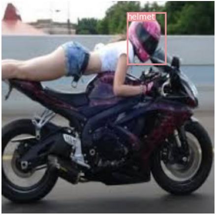</td>
<td></td>
</tr>
<tr>
<td></td>
<td>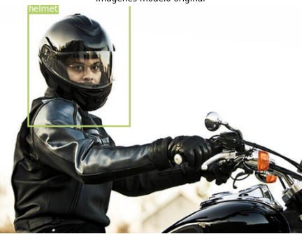</td>
<td></td>
</tr>
<tr>
<td></td>
<td></td>
<td></td>
</tr>
<tr>
<td></td>
<td></td>
<td></td>
</tr>
<tr>
<td></td>
<td>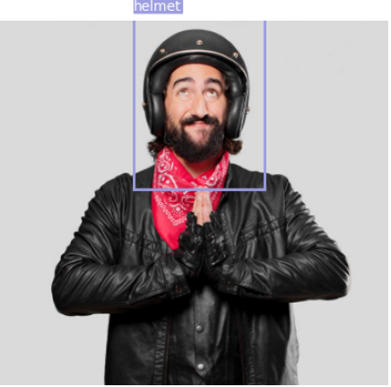</td>
<td></td>
</tr>
<tr>
<td></td>
<td></td>
<td></td>
</tr>
<tr>
<td></td>
<td>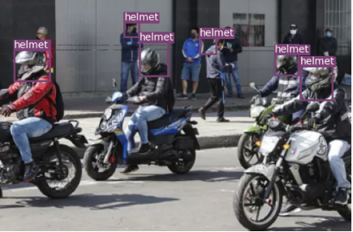</td>
<td></td>
</tr>
<tr>
<td></td>
<td>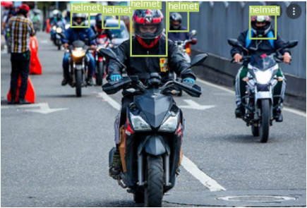</td>
<td></td>
</tr>
</table>

**Imagenes con Heatmap - clase "helmet"**

<table>
<tr>
<td>Resultados YOLOV3</td>
<td>Resultados YOLOV3 + SE</td>
<td>Resultados YOLOV3 + CBAM</td>
</tr>
<tr>
<td></td>
<td></td>
<td></td>
</tr>
<tr>
<td></td>
<td></td>
<td></td>
</tr>
<tr>
<td></td>
<td>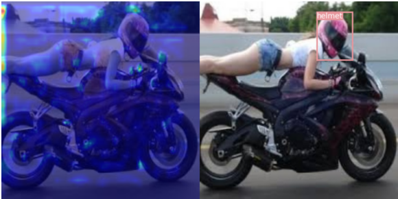</td>
<td></td>
</tr>
<tr>
<td></td>
<td>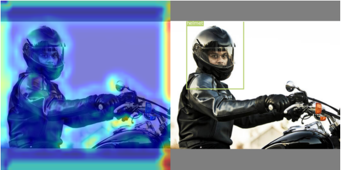</td>
<td></td>
</tr>
<tr>
<td></td>
<td>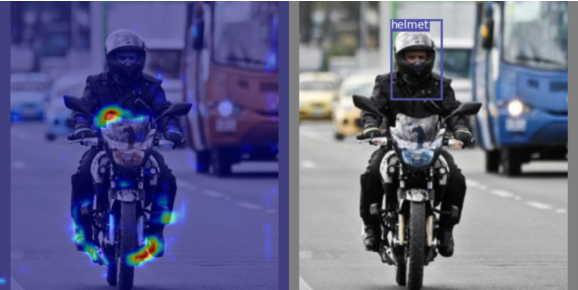</td>
<td></td>
</tr>
<tr>
<td></td>
<td>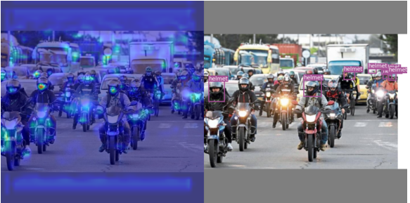</td>
<td></td>
</tr>
<tr>
<td></td>
<td></td>
<td></td>
</tr>
<tr>
<td></td>
<td>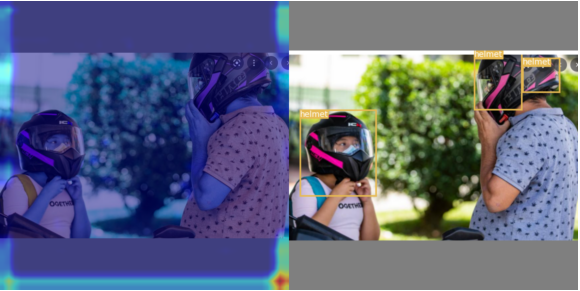</td>
<td></td>
</tr>
<tr>
<td></td>
<td></td>
<td></td>
</tr>
<tr>
<td></td>
<td></td>
<td></td>
</tr>
</table>
 
## **Conclusiones** ##
A través de la implementación realizada y descrita anteriormente, se pudo validar que para la aplicación de la detección y clasificación de casco de motociclistas en un ambiente de tráfico,donde la confusa información de fondo causa un gran impacto en la detección del objetivo. Mediante la arquitectura de red YOLOv3-tiny se observó que  hubo dificultades en la identificación de objetos superpuestos, y no fue  fácil para el modelo distinguirlas. 

En este sentido, se pudo validar que los mecanismos o modelos de atención definitivamente mejoran el poder de enfoque,cuando integramos los módulos de atención SE y CBAM a la red YOLO se observó mejoras en la precisión de detección a  los objetivos pequeños.


## **Links alternos al repositorio:** ##
* [Repositorio Google Drive](https://drive.google.com/drive/folders/1XLkhu0QKoeiVU00qahQfJsPmESpb9Y3l?usp=sharing)

## **Referencias:** ##
* [LabelImg](https://github.com/tzutalin/labelImg)
* [PyTorch-YOLOv3](https://github.com/promach/PyTorch-YOLOv3)
* [Sibozhu-GradCam](https://github.com/Sibozhu/grad-cam-formula-student) 
